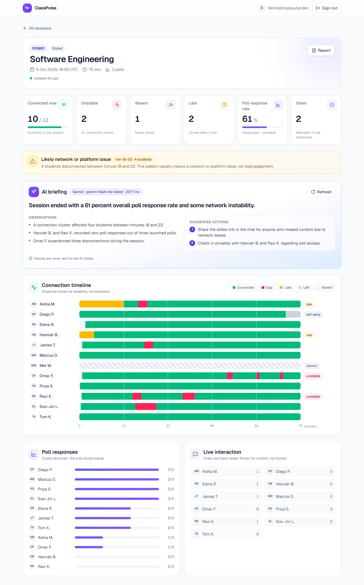
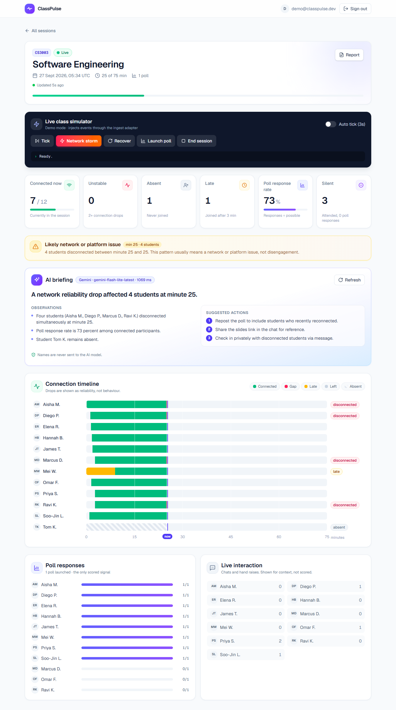
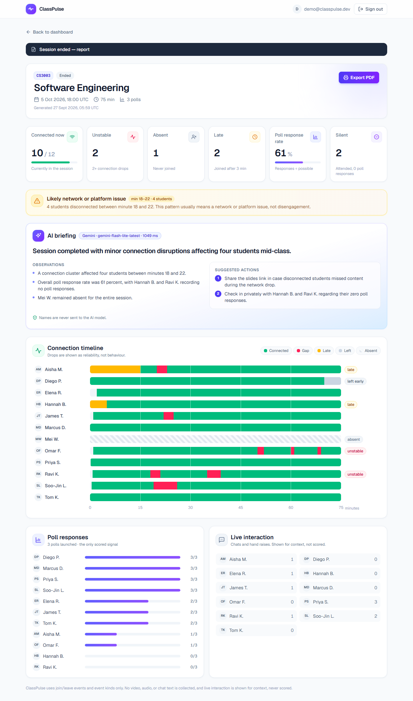
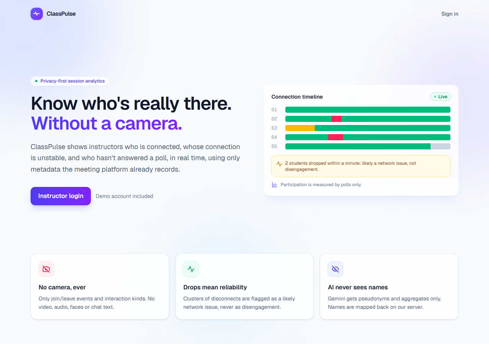
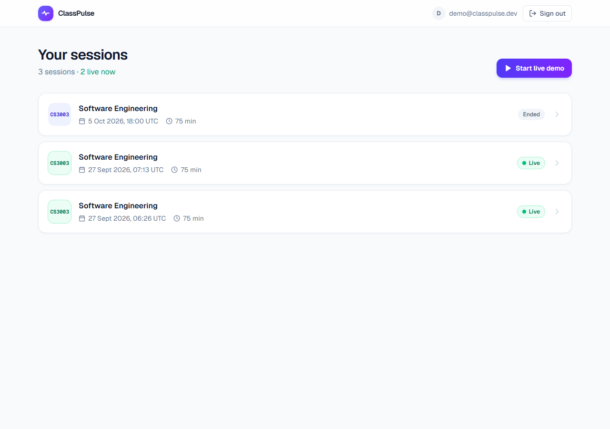
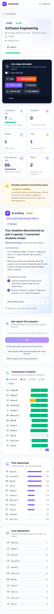

# ClassPulse

**Camera-free, privacy-first session reliability for live online classes.**

ClassPulse is a real-time dashboard for instructors teaching live online classes. It answers three questions while the class is happening:

1. **Who is actually connected?**
2. **Whose connection is unstable?**
3. **Who hasn't responded to polls?**

It uses only metadata the meeting platform already records: join/leave events and the *kind* of interaction (poll response, chat, hand raise). It never touches video, audio, faces or message content, and it never produces an "attention score". Deterministic code detects; Google Gemini supplies the judgement. It connects signals the metrics can't: for example, "the poll's 40% response rate is misleading, because 3 students were disconnected when it opened and 100% of connected students answered". It says what changed since its last briefing and sets a priority. Instructors can also ask it questions about the session. It declines, by design, anything about attention or emotion. A rules-based fallback keeps the core dashboard working without Gemini.

**Live demo:** https://class-pulse-hack-nite.vercel.app



---

## Screenshots

All screenshots use the seeded demo data (12 fictional students in CS3003).

| Live demo: network storm | Post-session report |
|---|---|
|  |  |
| Four students drop at once. ClassPulse flags a possible shared connectivity issue, not disengagement, and the AI briefing refreshes for the new alert. | A frozen, printable view of the same metrics. **Export PDF** keeps the timeline colours and never splits a row across pages. |

| Landing page | Session list |
|---|---|
|  |  |

<p align="center">
  <br>
  <sub>Mobile (390 px): stat cards two per row, and the timeline scrolls inside its card.</sub>
</p>

---

## Privacy by design

These six rules are enforced in the code, not just the pitch:

| # | Principle | How it's enforced |
|---|---|---|
| 1 | **No camera or facial analysis, ever.** | There is no media pipeline. The schema has no column that could hold video, audio or images. |
| 2 | **Data minimisation.** | Only event type + timestamp are stored. `participation_events` has no text column, so chat *content* cannot be stored. |
| 3 | **Participation is measured by polls only.** | "Silent" means attended and zero poll responses. Chats and hand raises are shown as neutral "Live interaction" counts, in roster order, never scored, ranked or colour-coded. |
| 4 | **Disconnections are reliability, not behaviour.** | 3+ students leaving within 10 minutes raises a "possible shared connectivity issue" alert, never a blame signal. |
| 5 | **The LLM never sees student names.** | `lib/model-context.ts` is the single privacy boundary. It builds the pseudonymised payload (`S1`, `S2`, …, aggregates only) and masks names in instructors' questions; names are restored server-side. `lib/model-context.test.ts` asserts that no name or id appears in the payload. The dashboard's "What Gemini sees" panel shows the exact input and output. |
| 6 | **All timestamps are UTC `timestamptz`.** | Minute offsets are computed server-side from `sessions.started_at`. Dates are displayed in UTC. |

Row Level Security means an instructor can only read their own sessions and those sessions' events. Every write goes through server code with the service-role key; there are no client-side writes.

---

## Architecture

```
Browser (instructor)                     Vercel (Next.js 16, App Router)                 Services
─────────────────────                    ─────────────────────────────────               ─────────────────────────
Dashboard / report pages  ──fetch──▶     proxy.ts (session refresh, /sessions guard)
                                         GET  /api/sessions/[id]/dashboard ──RLS──▶      Supabase Postgres + Auth
                                         POST /api/gemini-summary ──S-labels only──▶     Google Gemini API
                                         POST /api/ask            ──S-labels only──▶       (JSON-schema output)
                                         POST /api/sessions/[id]/simulate
                                              └─▶ lib/ingest.ts ──service role──▶        Supabase Postgres
useSessionRealtime  ◀── postgres_changes (RLS-scoped) ───────────────────────────────    Supabase Realtime
```

- **`lib/metrics.ts`**: all detection logic as pure functions: timelines, stats, reliability alerts and per-poll context (`pollContext`: who was connected when each poll opened). It's covered by `lib/metrics.test.ts`.
- **`lib/ingest.ts`**: the single write path for events, shared by the simulator and the Zoom webhook.
- **Zoom webhook** (`POST /api/webhooks/zoom`):
  - Answers Zoom's `endpoint.url_validation` challenge.
  - Verifies `x-zm-signature` (HMAC-SHA256 over the raw body, timing-safe compare, 5-minute replay window).
  - Maps `meeting.participant_joined/left` to join/leave events.
  - Finds the live session by `external_meeting_id`, then matches the student by `external_participant_id`, falling back to display name within the course.
  - Reads only ids, the display name and a timestamp; emails and other payload fields are ignored.
  - It's covered by `lib/zoom.test.ts` and tested end to end with signed requests. It hasn't been connected to a production Zoom app yet.
- **Realtime**: the dashboard subscribes to inserts on `connection_logs`/`participation_events` and updates to its session row, then refetches, debounced. There are no polling loops.
- **Gemini** (`@google/genai`, `responseJsonSchema` structured output, validated at runtime, 8 s cutoff):
  - **Briefing** (`/api/gemini-summary`): receives stats, alerts, poll context, the last 5 minutes of join/leave events and its own previous briefing. Returns `whatChanged`, cross-signal `insights`, `suggestedActions` (the first doable in the next 60 seconds), a `priority` (`act_now`/`monitor`/`all_clear`) and a `headline`. If Gemini fails, a rules-based briefing is used and labelled in the UI.
  - **Ask** (`/api/ask`): answers instructors' questions from the same pseudonymised data, citing the input fields used as evidence. It declines questions about attention, emotion, motivation, effort or cheating (`answerable: false`). There is no fallback: it returns 503 if Gemini is unavailable.

**Stack:** Next.js 16 · React 19 · TypeScript · Tailwind CSS 4 · Supabase (Postgres, Auth, Realtime, RLS) · Google Gemini (`@google/genai`) · Vitest · Vercel.

---

## Setup

Requirements: Node 20+ (tested on Node 24), a Supabase project, and a Gemini API key from Google AI Studio. All commands work in PowerShell, cmd or bash.

1. **Install**
   ```
   npm install
   ```
2. **Database:** in the Supabase SQL Editor, run `supabase/schema.sql`. It creates the tables, RLS policies and the Realtime publication.
3. **Environment:** copy `.env.example` to `.env.local` and fill it in (see below).
4. **Seed demo data.** This creates the demo instructor and the CS3003 scenario. It's idempotent and safe to re-run.
   ```
   npm run seed
   ```
5. **Run**
   ```
   npm run dev
   ```
   Open http://localhost:3000 and sign in with `DEMO_INSTRUCTOR_EMAIL` / `DEMO_INSTRUCTOR_PASSWORD`.

| Script | What it does |
|---|---|
| `npm run dev` | Development server |
| `npm run build` / `npm start` | Production build / serve |
| `npm test` | Vitest suites for `lib/metrics.ts` and the Zoom HMAC helpers |
| `npm run typecheck` | `tsc --noEmit` |
| `npm run seed` | Recreate the demo instructor's data |

### Environment variables

| Variable | Scope | Purpose |
|---|---|---|
| `NEXT_PUBLIC_SUPABASE_URL` | public | Supabase project URL |
| `NEXT_PUBLIC_SUPABASE_ANON_KEY` | public | Supabase anon/publishable key (RLS applies) |
| `SUPABASE_SERVICE_ROLE_KEY` | **server-only** | Seed script, simulator and ingest writes. Bypasses RLS. |
| `GEMINI_API_KEY` | **server-only** | Google AI Studio key |
| `GEMINI_MODEL` | server | Model id. `gemini-flash-lite-latest` measured ~1 s per briefing, against 3–6 s for `gemini-flash-latest`. |
| `NEXT_PUBLIC_DEMO_MODE` | public | `true` shows the Live Class Simulator. It's inlined at build time. |
| `DEMO_INSTRUCTOR_EMAIL` | server (seed) | Demo login email |
| `DEMO_INSTRUCTOR_PASSWORD` | server (seed) | Demo login password |
| `ZOOM_WEBHOOK_SECRET_TOKEN` | **server-only**, optional | Zoom app Secret Token. Without it, the webhook returns 503. |

Server-only keys are read only in `lib/supabase/admin.ts`, `lib/gemini.ts` (both `import "server-only"`) and `scripts/seed.ts`. On Vercel, set all eight under Project → Settings → Environment Variables, and redeploy after changing any of them.

---

## Demo flow

1. `/sessions` → open the ended **CS3003** session: 10/12 connected, 2 unstable (Ravi, Omar), 1 absent, 61% poll response rate, and one reliability alert at minutes 18–22.
2. **Start live demo** creates a live session 25 minutes in.
3. **Network storm**: four rows turn red and the alert appears live. The students auto-recover after 20 s.
4. **AI briefing** shows a badge with the model and latency, e.g. "Gemini · gemini-flash-lite-latest · ~1000 ms".
5. **Report** → **Export PDF** for the frozen, printable post-session view.

---

## What we deliberately did not build

- **Camera, face or emotion analysis of any kind.** Webcam "attention detection" is scientifically invalid and invasive. Students often turn cameras off for bandwidth, and they're exactly the students this is meant to help.
- **Attention or engagement scores.** No per-student score exists. Chat and hand raises are never ranked.
- **Storing chat text.** Only the fact that a chat happened is recorded.
- **Student-facing views, multi-tenant org management, email notifications.**
- **Chart libraries / D3.** The timeline is plain positioned `div`s.
- **A separate backend server.** API route handlers in the same Next.js app are enough.
- **Roster changes from webhook data.** The Zoom webhook only records join/leave for students already on the roster. Unknown participants are logged by id and ignored.
